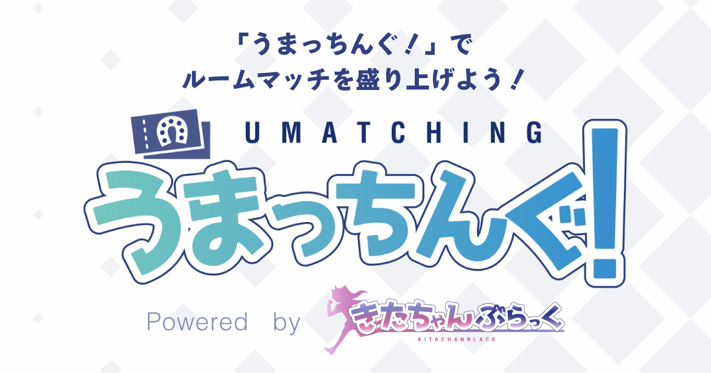

# うまっちんぐ！

**※「うまっちんぐ！」は現在ベータ版です。利用方法が大きく変わる可能性がございますのでご了承ください。**

## モチベーション
「うまっちんぐ！」はウマ娘のルームマッチ機能をより快適に、よりウマ娘を楽しくプレイできるようにしたいというモチベーションからリリースしました。  
特にこれまでの他のサービスなどの大会機能は、視聴者は参加できないのが大多数でしたが、「うまっちんぐ！」では視聴者も投票（ウマチケ）ができることで全員参加型を目指しています。  
みなさんに最高にウマ娘を楽しむ環境を用意できればと思います。

## フィーチャー

- [x] シングルレース
- [ ] 投票機能
    - [x] 単勝
    - [ ] 複勝
    - [ ] 応援 
    - [ ] トレーナー単勝
- [ ] 大会機能
- [ ] チーム戦
- [ ] レート戦

## 開発要望について
TODO

## バグ発見時の報告先
TODO

## 開発募集について
TODO

## お問い合わせ先
- 開発者アカウント: [@oliver_uma](https://twitter.com/oliver_uma) のDM
- Discord: [「うまっちんぐ！」コミュニティサーバー](https://discord.gg/DFCZF5Pd2x)
- お問い合わせフォーム: TODO
- メール: TODO