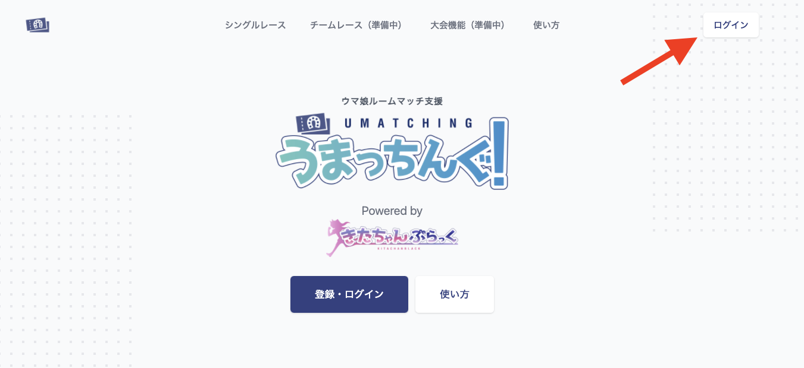
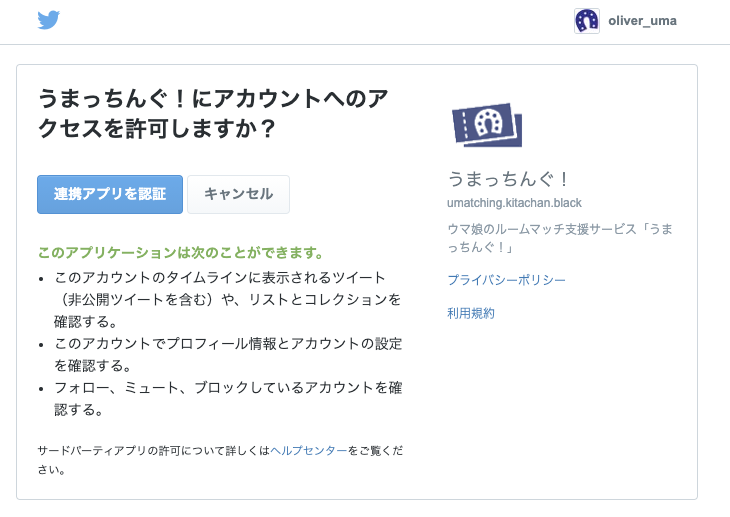
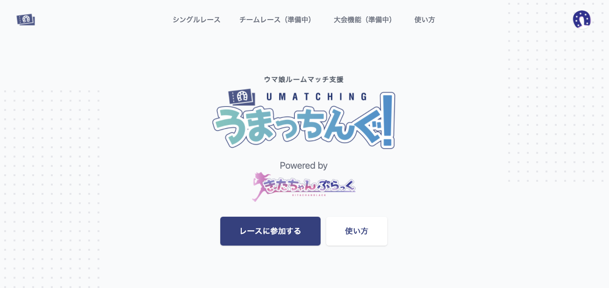

# 一般
## アカウント作成/ログイン方法
「うまっちんぐ！」を利用するには下記の方法でログインすることができます。

- Twitterアカウント
  
### Twitterアカウントを利用したアカウント作成やログイン方法
1. 画面右上からログインボタンを押す
    
1. 利用規約とプライバシーポリシーに同意後「連携アプリを認証」を押す
   
1. 「うまっちんぐ！」上の右上にアイコンが表示されれば成功
   

## マイページについて
「うまっちんぐ！」のマイページでは以下が利用可能です。

- 確認したレース
- 参加したレース
- 投票（ウマチケ）
- 設定
- ヘルプ
- ログアウト

### 開催したレース
自分が開催したレースを確認できます。

### 参加したレース
自分が参加したレースを確認できます。

### 投票（ウマチケ）
自分が投票したウマチケを確認できます。

### 設定
「うまっちんぐ！」上でのユーザー設定が行えます。

### ヘルプ
ヘルプに移動することができます。

### ログアウト
「うまっちんぐ！」からログインできます。

## 用語について
### ウマチケ
「うまっちんぐ上で」ウマ娘に対して投票した際に生成される画像のこと。

### 投票
ウマチケを買うこと、ポイントを運営に支払う行動のこと。
