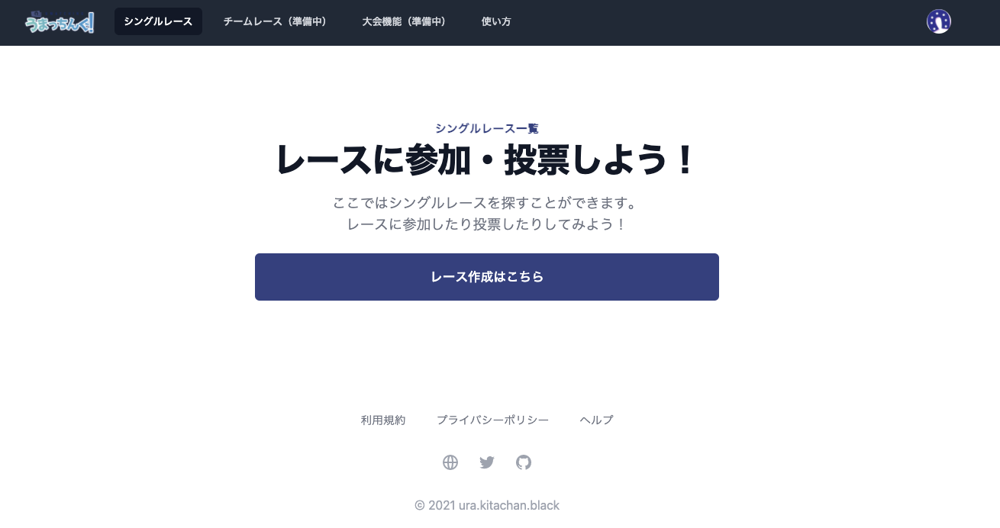
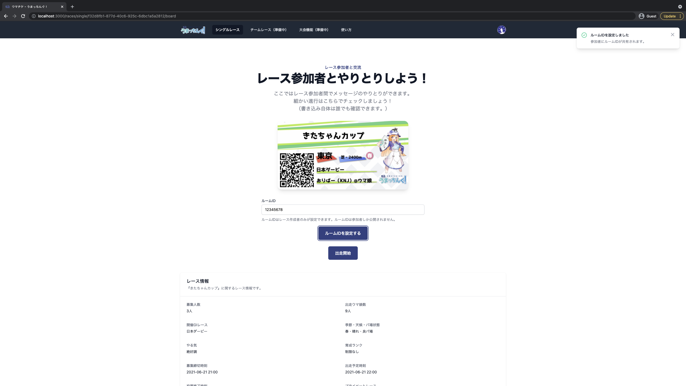
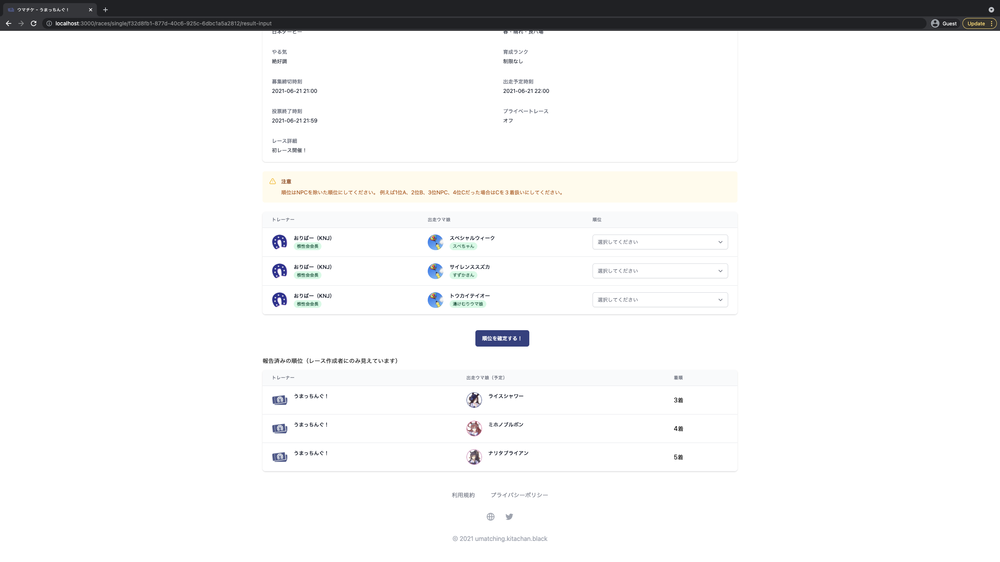
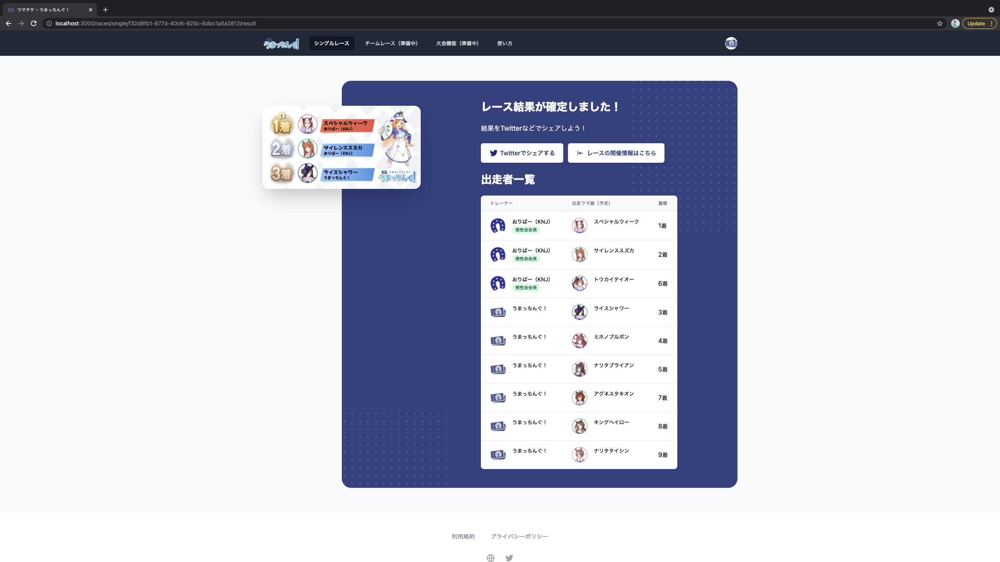

# シングルレース機能
## シングルレースとは
「シングルレース」は単体のレース募集したり投票ができる機能です。  
「ウマ娘」上で作成したルームを用いてシングルレースは進行していきます。

## レースの状態遷移について
シングルレースの状態は下記の通りになります。

|状態|遷移条件|詳細|
|:--|:--|:--|
|出走募集|レース作成後。|出走登録が可能な状態です。|
|解散|1.出走登録が0の状態で募集締切時刻に達した場合。2.最低出走人数に満たない状態で募集締切時刻に達した場合。(開発中)|このレースは「うまっちんぐ！」上では投票・出走ができなくなります。|
|投票募集|1. 出走登録が上限に達した場合。2. 最低出走人数を満たした状態で募集締切時刻に達した場合。(開発中)|投票が可能な状態です。|
|投票無効出走中|投票有効条件を**満たせない状態**で投票締切時刻に達した場合。(開発中)|投票が無効化された状態でレースが行われているか、参加者によるレース結果の入力中です。投票されたウマチケは投票者にオッズ「1.0」で分配されます。|
|出走中|投票有効条件を**満たした状態**で投票締切時刻に達した場合。|レースが行われているか、参加者によるレース結果の入力中です。|
|不正|入力されたレース順位が重複するか未入力順位がある状態で、24時間以上経過するかレース作成者が不正確定を行った場合。(未実装)|正確なレース結果が確定できないため、投票されたウマチケは投票者にオッズ「1.0」で分配されます。|
|確定|参加者全員が入力した順位に重複・未入力・不正箇所が無い場合。|レース結果と最終オッズが確定し、総投票ポイント数に応じた分配が行われます。|

## レース作成方法
シングルレースを作成するには画面上部から「シングルレース」を押していただき、「レースを作成する」ボタンを押してください。

シングルレースを作成するのに必要な項目は下記の通りです。

### レース概要
- 募集人数（3人~18人）
- 出走ウマ娘総数（9人~18人）
  
### レース詳細
- 開催GIレース名
- 季節・天候・バ場状態
- やる気
- 育成ランク

### 「うまっちんぐ！」特有情報
- 開催レース名
- 募集締切時刻（10分後 ~ 24時間後）
- 出走予定時刻（10分後 ~ 24時間後）
- レース詳細
- プライベートレース

## レース参加方法
シングルレースへの参加はレース詳細ページから可能です。

## レース開始までについて
作成・参加したレースはマイページの「開催したレース」または「参加したレース」に表示されます。  
こちらから「掲示板」にアクセスすることができ、参加者とやりとりすることが可能です。  
レースを開始するまでは下記の流れを辿ります。

1. 「トレーナー数が上限になる」または「強制出走締切」を押されると「投票募集」に遷移
1. 「投票受付期間が過ぎる」または「出走開始」を押されると「出走中」に遷移

また、ホストがレースIDを設定できるフィールドを用意してますのでご利用ください。

## レース開始後について
ウマ娘のアプリ上でレースを開始する前に必ず「うまっちんぐ！」上で「出走開始」ボタンを押してください。  
レース開始後は参加者自身のレース結果を記録しておいてください。

## レース結果入力方法
レースの結果入力ページへは「掲示板」から移動できます。  
自身の順位を入力してください。

## レース結果について
全員の結果入力が完了したらそのレースは「確定」状態になります。  
「確定」状態になったレースは結果画面が生成されます。

なお、他の参加者と順位が重複したりレース結果が未入力のままですと **レースが確定せず、ポイントの分配が行われません。**   
レースが出走中のまま24時間が経過すると不正レース扱いとなります。（未実装）

## 未出走ユーザーの扱いについて
TODO
