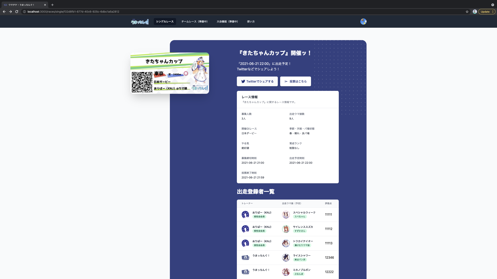
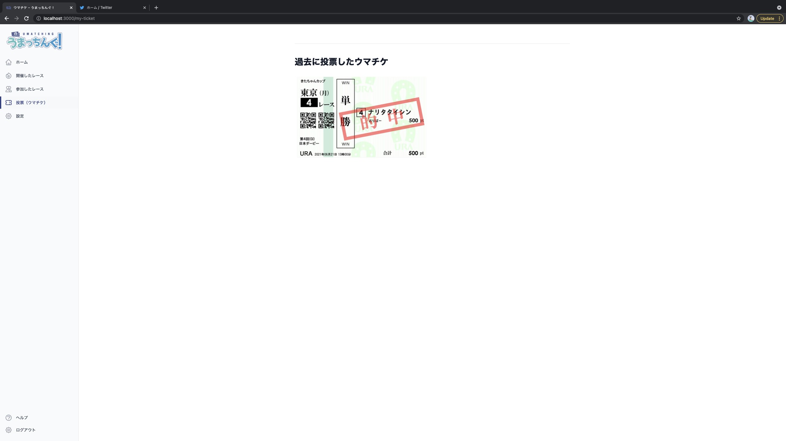

# 投票機能

## 投票とは
「うまっちんぐ！」ではトレーナーやウマ娘に投票することが可能です。  
作成されたレースに対して様々な種類のウマチケを投票することができます。投票画面からトレーナーとウマ娘を選びウマチケを投票できます。

## ウマチケについて
投票方法や投票ポイント数に応じたウマチケが発行され、投票したレース結果が確定した際に、ウマチケが的中していた場合には的中ラベルがついたウマチケが生成されます。

## ウマチケの種類
ウマチケは投票方法によって以下の種類に分類されます。

### 単勝

1着になるウマ娘を当てるウマチケ

- 単勝はもっともシンプルなウマチケで、どのウマ娘が勝つのかを当てるウマチケです。
- 全レースで発行可能です。

### 複勝（未実装）

3着までに入るウマ娘を当てるウマチケ

- 全レースで発行可能です。

### 応援ウマチケ（未実装）

1人のウマ娘の「単勝」と「複勝」を同時に投票できるウマチケ

- 応援ウマチケは、1人のウマ娘の単勝と複勝が1枚の投票チケットになっているウマチケです。
- お好きな「ウマ娘」を応援していただくという意味を込めて、ウマチケの上部に【がんばれ！】という文字が記載されます。
- 1つの生まれた番号ごとに1枚のウマチケが発券されます。
- オッズ・分配ポイントは、単勝・複勝と同じです。
- 一度に同じポイント数の単勝と複勝を同時に投票することになりますので、投票ポイント数はウマチケに記されている合計ポイント数になります。

### トレ単（未実装）
1着になるウマ娘のトレーナーを当てるウマチケ

- 全レースで発行可能です。

 
## 投票方法 
「うまっちんぐ！」上でレースの詳細画面から投票することが可能です。  

投票するとウマチケが自動生成され、的中した場合は的中ラベルが付与されます。  
また、一覧はマイページより確認できます。

